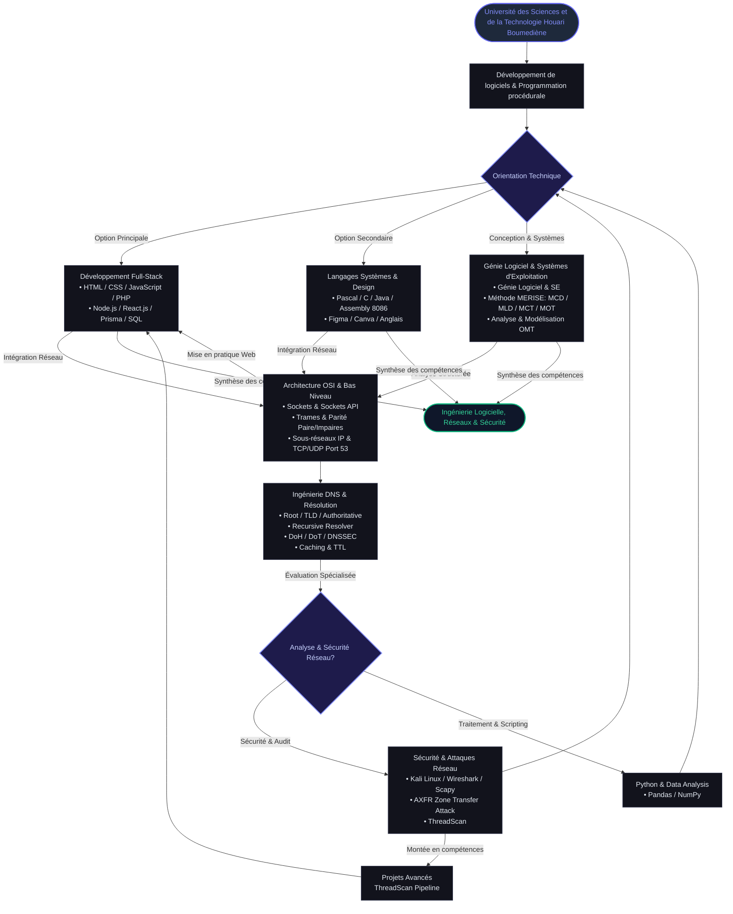

# Kirouane Nermine 19 years old 

### Full-Stack Developer · Network & Systems Security · CS Student @ USTHB

---

##  Competency Flowchart Architecture

---

## Competencies Matrix

| Domain | Skills & Technologies |
| :--- | :--- |
| **Education & Core** | Université des Sciences et de la Technologie 'Houari Boumediène', Système d'exploitation, Programmation procédurale, Développement de logiciels |
| **Full-Stack Web** | Développement full-stack, HTML, CSS, JavaScript, Node.js, React.js, PHP, prisma, SQL |
| **Network & Cyber Security** | Linux, Kali Linux, Wireshark, Sockets, Protocole TCP, Couche 3, IPv4, Serveur DNS, Sécurité réseau, Informatique Sécurisée |
| **Programming Languages** | C (langage de programmation), Java, Python (langage de programmation), JavaScript, PHP, SQL |
| **Design & Languages** | Figma (logiciel), Canva |
| **langages I speak** | English , Frensh , Arabic , Kabyle , espagnole |

---

  <i>bye </i>

