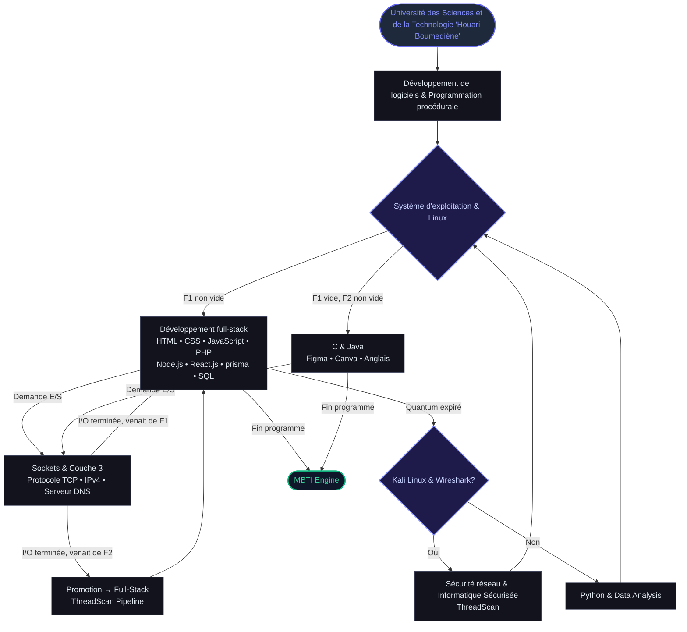

<div align="center">

# Kirouane Nermine 19 years old 

### Full-Stack Developer · Network & Systems Security · CS Student @ USTHB

[](https://github.com/KirouaneNermine)
[](https://usthb.dz)

</div>

---

##  Competency Flowchart Architecture



---

## Workflow Pipelines

```
HTML ---> CSS ---> PHP ---> JavaScript ---> Node.js ---> prisma ---> SQL
```
```
Linux ---> Kali Linux ---> Wireshark ---> Protocole TCP ---> Sockets ---> IPv4 ---> Serveur DNS
```
```
Système d'exploitation ---> Couche 3 ---> Informatique Sécurisée ---> Sécurité réseau ---> ThreadScan
```
```
Python ---> Pandas ---> NumPy ---> Data Analysis ---> Machine Learning
```
```
Figma ---> Canva ---> HTML ---> CSS ---> React.js
```

---

## Competencies Matrix

| Domain | Skills & Technologies |
| :--- | :--- |
| **Education & Core** | Université des Sciences et de la Technologie 'Houari Boumediène', Système d'exploitation, Programmation procédurale, Développement de logiciels |
| **Full-Stack Web** | Développement full-stack, HTML, CSS, JavaScript, Node.js, React.js, PHP, prisma, SQL |
| **Network & Cyber Security** | Linux, Kali Linux, Wireshark, Sockets, Protocole TCP, Couche 3, IPv4, Serveur DNS, Sécurité réseau, Informatique Sécurisée |
| **Programming Languages** | C (langage de programmation), Java, Python (langage de programmation), JavaScript, PHP, SQL |
| **Design & Languages** | Figma (logiciel), Canva, Anglais |
| **Featured Projects** | MBTI Engine, ThreadScan |

---

## GitHub Statistics

<div align="center">


<br/><br/>


</div>

---

<div align="center">
  <i>bye </i>
</div>
